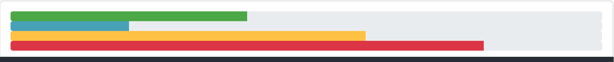
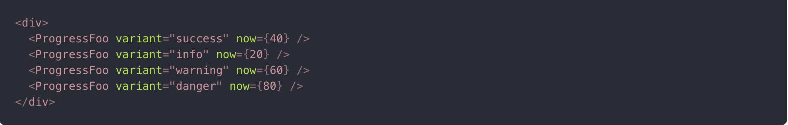
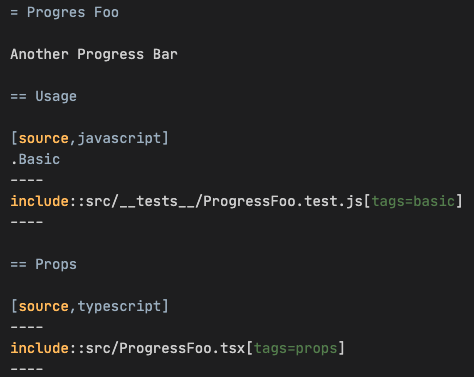
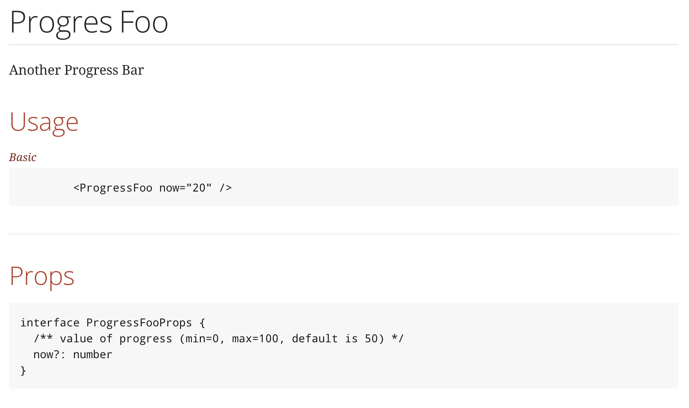
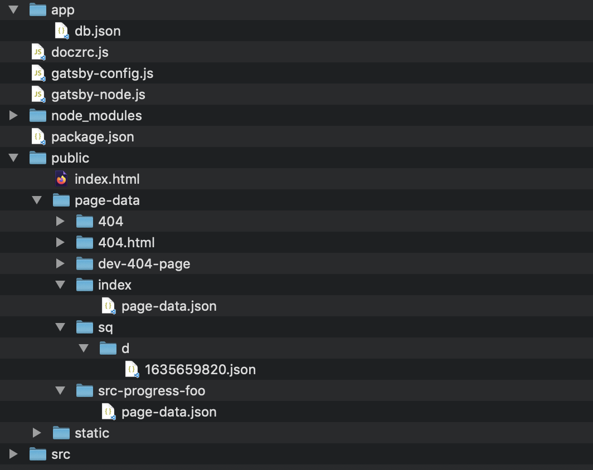
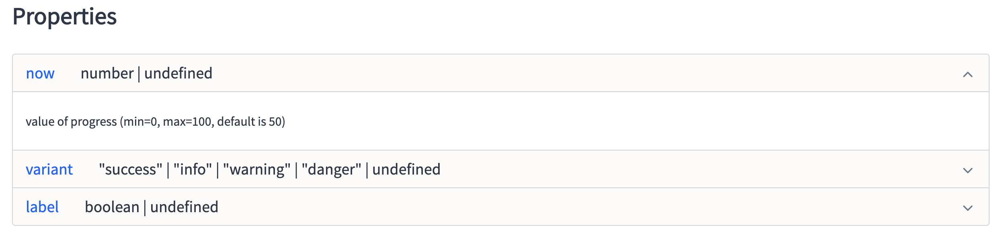
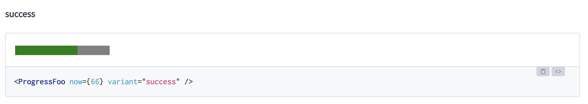

= 🌟 Docz : 📝 your React components
:source-highlighter: highlightjs
:revealjs_theme: white
:revealjs_history: true
:revealjs_plugin_pdf: enabled
:revealjs_plugin_highlight: enabled
:customcss: custom.css
:data-uri:
:icons: font

== Il était une fois ...

* 1 projet
* Plusieurs feature teams (`React`)
* Une même UX

🤝
Des composants `React` communs maintenus par _tout le monde_

== Tech Lead 👉 "Benoit Prioux"

icon:twitter[] icon:github[] binout / ❤️ Asciidoctor (🐜)

image:images/lectra.png[width=40%]

image:images/lectra-versalis.png[width=40%]

== 📖 RTFM !

[quote, Tech Lead]
🤓 : Il faut mettre en place le process de documentation dès le 1er commit ! 

[quote, Dev]
😤 : On en a réellement besoin ? La doc ne sera jamais à jour ...

== 💪 Challenge Accepted

La documentation :

* doit être simple (et fun) à écrire
* doit être facilement accessible et utile
* doit être toujours à jour 

== Progress Foo 

== README

.https://github.com/kefranabg/readme-md-generator
image::https://user-images.githubusercontent.com/9840435/60266022-72a82400-98e7-11e9-9958-f9004c2f97e1.gif[]

== Check up 

* ✅ simple à écrire
* ✅ facilement accessible et utile
* ❌ toujours à jour

== Living documentation 

image::https://images-na.ssl-images-amazon.com/images/I/51fjfN1lKLL._SX380_BO1,204,203,200_.jpg[]
 
== Asciidoc FTW !

image::https://blog.oxiane.com/wp-content/uploads/2018/06/logo_asciidoctor_300.png[]

* Mieux que `Markdown` (selon moi 😝)
* Inclusion de code source dans la documentation 

== Exemple 

== Code

[source, typescript]
----
// tag::props[]
interface ProgressFooProps {
  /** value of progress (min=0, max=100, default is 50) */
  now?: number
}
// end::props[]

const ProgressFoo = ({ now = 50 }: ProgressFooProps) => .... 
----

== README.adoc

== Check up  

* ✴️ simple à écrire
* ✅ facilement accessible et utile
* ✅ toujours à jour

== 🤔 💡

== 🚀 Docz 🚀

https://www.docz.site/

* Basé sur l'écriture de fichiers `MDX`
* Génère un site statique

== MDX ? 

MDX = `Markdown` + `JSX` 🤯

[source, mdx]
----
# Hello, *world*!

Below is an example of JSX embedded in Markdown.

  <h3>This is JSX</h3>

----

== Documentation

image::https://camo.githubusercontent.com/e83b8f6797105464270b7ad1a5cae1badd367f30/68747470733a2f2f63646e2d7374642e64707263646e2e6e65742f66696c65732f6163635f3634393635312f533259434944[]

== 🤓 Getting Started

[source]
----
npm install docz
----

[TIP]
====
Required `react` et `react-dom` >= 16.8.0 
====

== 😎 Typescript support

.doczrc.js
[source]
----
export default {
    typescript: true
};
----

== 🚀 Build and serve

.package.json
[source]
----
"scripts": {
    "docz:dev": "docz dev",
    "docz:build": "docz build",
    "docz:serve": "docz build && docz serve"
}
----

== 🛠 Under the hood

Génère un site statique basé sur https://www.gatsbyjs.com/

== 🤩 Built-in components `<Props`>

Documentation for components props

* Supports `flow`, `prop-types` and `Typescript`

[source]
----
import { Props } from 'docz'
import ProgressFoo from './ProgressFoo.tsx'

<Props of={ProgressFoo} />
----

== 🤩 Built-in components `<Props`>

[source]
----
interface ProgressFooProps {
  /** value of progress (min=0, max=100, default is 50) */
  now?: number,
  /** variant which defines color (default is info) */
  variant?: 'success' | 'info' | 'warning' | 'danger',
  /** set to true to display a label next to progress bar (default is false) */
  label?: boolean
}

const ProgressFoo = ({ now = 50, variant = 'info', label = false }: ProgressFooProps) => {
  ...
}
----

== 🤩 Built-in components `<Props`>

== 🤩 Built-in components `<Playground`>

Editable rendering

[source]
----
import { Playground } from 'docz'
import ProgressFoo from './ProgressFoo.tsx'

<Playground>
  <ProgressFoo now={66} variant="success" />
</Playground>
----

== 🤩 Built-in components `<Playground`>

== 😎 Démo

image::https://dbdzm869oupei.cloudfront.net/img/sticker/preview/14865.png[]

== Check up  

* ✅ simple à écrire
* ✅ facilement accessible et utile
* ✅ toujours à jour

== One More Thing 🤩

💡 Docz = environnement de développement et d'intégration

[NOTE]
====
😅 Permet d'éviter `npm link` ou `yalc`
====

== Feedback 👍

* 🚀 Mise en place et prise en main
* 🎭 Facile à customizer
* 📚 Permet de construire un site de documentation

== Feedback 👎

* 🧐 Support Typescript à améliorer
* 🐘 Un peu _lourd_ 
* 😤 Des problèmes de cache (🗑 `.docz`)

== Alternative - react-styleguidist

https://github.com/styleguidist/react-styleguidist

== Alternative - storybook

https://storybook.js.org/

== Pour conclure

* 🤗 Eco-système riche ... mais en constante évolution
* 😛 Fun d'écrire de la documentation

image::https://sd.keepcalms.com/i/keep-calm-and-document-properly.png[height=240]
